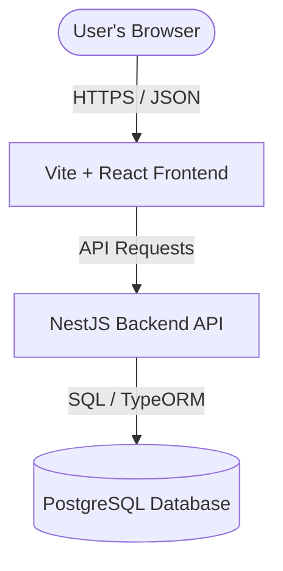

# 🏪 Store Rating & Management System

Welcome to the **Store Rating & Management System**—a modern, full-stack web application designed for listing stores, submitting user reviews, calculating real-time aggregate ratings, and providing customized dashboards for different roles.

The application is fully live and deployed:
*   💻 **Live Frontend:** [https://jaggutech24-maker.github.io/store-rating-management-system/](https://jaggutech24-maker.github.io/store-rating-management-system/)
*   ⚙️ **Live Backend API:** `https://store-rating-backend-8u2y.onrender.com/api`

---

## 🏗️ System Architecture

The project is structured as a **decoupled monorepo** containing two distinct applications:



### 1. Frontend (Client-side)
*   **Technologies:** React 18, Vite (for ultra-fast development and build times), TypeScript, and TailwindCSS (for sleek, modern UI styling).
*   **Hosting:** Hosted on **GitHub Pages**, which serves the statically compiled assets.
*   **Routing:** Dynamic browser routing managed via React Router.

### 2. Backend (Server-side)
*   **Technologies:** NestJS (progressive Node.js framework), TypeScript, and TypeORM.
*   **Database:** PostgreSQL (fully managed production instance).
*   **Hosting:** Hosted on **Render.com** (Web Service + Managed Database) with automated Git-triggered deployments.

---

## 👥 User Roles & Permissions

The platform uses a role-based authorization system with three distinct user roles:

### 1. 👑 System Administrator (`admin`)
*   **Dashboard Stats:** Real-time counters displaying the *Total Users*, *Total Stores*, and *Total Ratings* currently in the system.
*   **User Management:** Can create new users (Admins, Store Owners, or Normal Users) with Name, Email, Password, and Address.
*   **Store Management:** Can add new stores and automatically link them to existing Store Owners.
*   **Lists & Filtering:** Has access to comprehensive search and filter panels (filter by Name, Email, Address, or Role) across all stores and users.

### 2. 🏪 Store Owner (`store_owner`)
*   **Dashboard Overview:** Displays their specific store's statistics, including the **Total Reviews received** and the **Live Average Rating** (calculated in real time).
*   **Review Feed:** Displays a chronological, detailed list of all ratings, scores (1 to 5), and review text submitted specifically for their store.

### 3. 👤 Normal User (`user`)
*   **Store Directory:** A rich grid interface where they can browse and search registered stores.
*   **Submit Ratings:** Can click on any store to submit a rating (1 to 5 stars) along with a text review (guarded by database constraints to prevent double-rating the same store).
*   **Profile Management:** Can update their display name, contact address, and securely change their account password.
*   **Registration:** Anyone can sign up directly via the Registration screen to become a Normal User.

---

## 🗄️ Database Schema (PostgreSQL)

The database schema is managed automatically by TypeORM through entities and relations:

```
┌─────────────────────────────────┐
│              users              │
├─────────────────────────────────┤
│ id (PK)                         │
│ name (varchar)                  │
│ email (varchar, unique)         │
│ password (varchar)              │
│ address (text)                  │
│ role (enum: admin, owner, user) │
└──────────────┬──────────────────┘
               │ 1
               │
               │ 1 (ownerId)
┌──────────────▼──────────────────┐
│             stores              │
├─────────────────────────────────┤
│ id (PK)                         │
│ name (varchar)                  │
│ email (varchar)                 │
│ address (text)                  │
│ ownerId (FK, nullable)          │
└──────────────┬──────────────────┘
               │ 1
               │
               │ 1 (storeId)
┌──────────────▼──────────────────┐
│             ratings             │
├─────────────────────────────────┤
│ id (PK)                         │
│ rating (int, 1 to 5)            │
│ userId (FK, relations to users) │
│ storeId (FK, relations to stores)│
└─────────────────────────────────┘
```

*   **Auto-Seeding:** On the very first boot of the backend database, if no users are detected, the system automatically initializes the database with a pre-seeded collection of accounts, stores, and ratings for testing.

---

## 🛠️ Local Development Setup

To run the entire full-stack application on your local machine, follow these steps:

### Prerequisites
*   Node.js (v18 or higher recommended)
*   PostgreSQL installed and running locally

### 1. Backend Setup
1. Open a terminal in `store-rating-backend`:
   ```bash
   cd store-rating-backend
   ```
2. Install the dependencies:
   ```bash
   npm install
   ```
3. Configure the local environment variables. Create a `.env` file inside `store-rating-backend` and add:
   ```env
   NODE_ENV=development
   PORT=3000
   DB_HOST=localhost
   DB_PORT=5432
   DB_USERNAME=postgres
   DB_PASSWORD=your_postgres_password
   DB_DATABASE=store_rating_db
   JWT_SECRET=super_secret_key_change_me_in_prod
   JWT_EXPIRATION=24h
   ```
4. Run the database setup in PostgreSQL (create a database named `store_rating_db`).
5. Start the development server:
   ```bash
   npm run start:dev
   ```
   *The backend will boot up at `http://localhost:3000/api` and auto-seed the initial tables.*

### 2. Frontend Setup
1. Open a terminal in the root project folder:
   ```bash
   cd ..
   ```
2. Install the dependencies:
   ```bash
   npm install
   ```
3. Configure the frontend local environment variables. Create a `.env` file in the root directory:
   ```env
   VITE_API_URL=http://localhost:3000/api
   ```
4. Start the frontend Vite server:
   ```bash
   npm run dev
   ```
   *The frontend will run locally at `http://localhost:5173/`.*

---

## 🚀 Step-by-Step Production Deployment Guide

Deploying this full-stack application utilizes modern, fully automated Cloud CI/CD workflows. Here is exactly how it was set up and deployed:

### Part 1: Deploying the NestJS Backend to Render.com

#### Step 1: Render Account Setup
1. Log in to [Render.com](https://render.com) using your **GitHub account**.
2. Render automatically accesses your public repositories.

#### Step 2: Automatic Provisioning via Blueprint (`render.yaml`)
To make deployment seamless and error-free, we added a `render.yaml` blueprint file in the backend root directory. It tells Render exactly how to build and connect your services:

```yaml
services:
  - type: web
    name: store-rating-backend
    runtime: node
    buildCommand: npm install --include=dev && npm run build && npm prune --production
    startCommand: node dist/main
    envVars:
      - key: NODE_ENV
        value: production
      - key: PORT
        value: 3000
      - key: DB_HOST
        fromDatabase:
          name: store-rating-db
          property: host
      - key: DB_PORT
        fromDatabase:
          name: store-rating-db
          property: port
      - key: DB_USERNAME
        fromDatabase:
          name: store-rating-db
          property: user
      - key: DB_PASSWORD
        fromDatabase:
          name: store-rating-db
          property: password
      - key: DB_DATABASE
        fromDatabase:
          name: store-rating-db
          property: database
      - key: JWT_SECRET
        generateValue: true
      - key: JWT_EXPIRATION
        value: 24h

databases:
  - name: store-rating-db
    databaseName: store_rating_db
    user: store_rating_user
    plan: free
```

1. On the Render Dashboard, click **New** → **Blueprint**.
2. Select your `store-rating-backend` repository.
3. Click **Apply**.
4. **Render will automatically:**
   * Spin up a free, managed **PostgreSQL database**.
   * Link all database environment variables (host, user, password, port, database name) directly to the web service securely.
   * Generate a secure random `JWT_SECRET` key for session authentication.
   * Spin up the NestJS web service, run the build script, connect to the database, auto-create tables, and seed the demo data.

#### 💡 Troubleshooting Key Production Challenges
*   **Database SSL Connections (Solved):** Production databases require SSL. We updated the backend's `TypeOrmModule` configuration in `src/app.module.ts` to automatically detect production mode and enable secure SSL connections:
    ```typescript
    ssl: isProd ? { rejectUnauthorized: false } : false
    ```
*   **Status 127 Build Error (Solved):** NestJS uses the `@nestjs/cli` compiler (a `devDependency`) to build production bundles. Setting `NODE_ENV=production` causes standard `npm install` commands to skip these packages. We configured Render's build script to install them for compilation, build the bundle, and then prune the devDependencies so your server stays small:
    ```bash
    npm install --include=dev && npm run build && npm prune --production
    ```
*   **External Network Bindings (Solved):** Render expects Node.js servers to listen on all interfaces. We updated `src/main.ts` to bind specifically to `0.0.0.0` inside production containers:
    ```typescript
    await app.listen(port, '0.0.0.0');
    ```

---

### Part 2: Deploying the React Frontend to GitHub Pages

#### Step 1: Configure the Deployment Package
To automate compiling and pushing the static output folder (`dist`) to a special `gh-pages` branch, we installed the `gh-pages` library:
```bash
npm install --save-dev gh-pages
```

#### Step 2: Add Deployment Scripts
In the frontend [package.json](file:///c:/Users/jaggu/Downloads/store-rating-management-system/package.json), we configured two build scripts:
```json
"scripts": {
  "predeploy": "npm run build",
  "deploy": "gh-pages -d dist"
}
```
*   `predeploy` automatically executes `vite build` to generate the HTML, JS, and CSS static bundle in the `dist` folder.
*   `deploy` takes the contents of the `dist` folder and safely pushes them to the `gh-pages` branch on GitHub.

#### Step 3: Production API Setup
We updated the frontend's production environment variables in the [.env](file:///c:/Users/jaggu/Downloads/store-rating-management-system/.env) file:
```env
VITE_API_URL=https://store-rating-backend-8u2y.onrender.com/api
```
This ensures that the build scripts compile the client-side code with the live Render backend URL instead of your local machine's `localhost:3000`.

#### Step 4: Run the Deploy Script
In your terminal, execute the following command:
```bash
npm run deploy
```
This single command automatically compiles the codebase and uploads the live website to GitHub. It will be served directly at:
`https://YOUR_GITHUB_USERNAME.github.io/store-rating-management-system/`

---

## ⚡ How the Automated Workflow Works (Going Forward)

Now that everything is configured, updating your full-stack application is incredibly simple and fully automated!

### To Update the Backend:
1. Make changes to your backend code in `store-rating-backend`.
2. Push your changes to your backend repository on GitHub:
   ```bash
   git add .
   git commit -m "Your update message"
   git push origin main
   ```
3. **Render will immediately notice the new commit, rebuild your NestJS code, and apply the update live with zero downtime!**

### To Update the Frontend:
1. Make changes to your frontend files.
2. In the project root directory, run a single command:
   ```bash
   npm run deploy
   ```
3. **The script will automatically compile your frontend changes and push them live on GitHub Pages in under a minute!**
